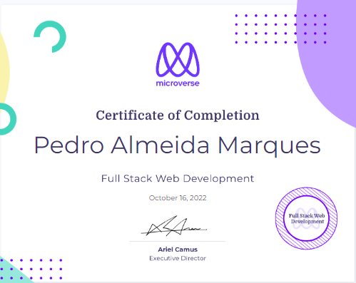

## Hey 👋, I'm Pedro Marques

 
 
🌟 I am from Brazil and living in Lisbon, Portugal - Europe.
 
🔆 I'm a Full-Stack Developer with knowledge of JavaScript, React, Redux, Ruby on Rails, and I have solid experience as a Senior Project Manager. I am looking for a Remote Tech job opportunity.
 
📫 How to reach me: ppmarq1@gmail.com;
 
[My Portfolio Link](https://my-portfolio-ppmarq1.netlify.app/)

 
  
  
### Talking about Personal Stuffs:

- 🌱 I’m currently searching for a job opportunity as a Junior Backend Developer;
- 👨‍🎓 I’m mentoring the new Students at @microverseinc ☺ ;
- 💬 Ask me about anything, I am happy to help;

 
 

### Languages and Tools:

 
 
  

  
  
         
  
  
  

 
 

### Certificates:
 

 
 

 

